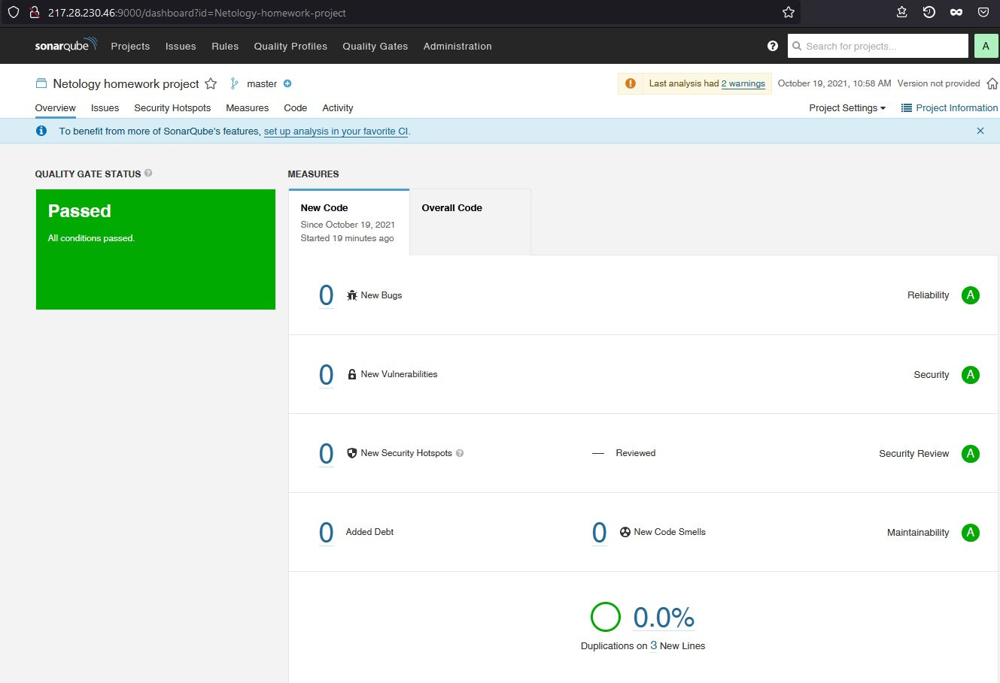

### Домашнее задание к занятию "09.03 CI\CD"


#### Знакомоство с SonarQube

#### Основная часть

1. Создаём новый проект, название произвольное
2. Скачиваем пакет sonar-scanner, который нам предлагает скачать сам sonarqube
3. Делаем так, чтобы binary был доступен через вызов в shell (или меняем переменную PATH или любой другой удобный вам способ)
4. Проверяем `sonar-scanner --version`
5. Запускаем анализатор против кода из директории [example](./example) с дополнительным ключом `-Dsonar.coverage.exclusions=fail.py`
6. Смотрим результат в интерфейсе
7. Исправляем ошибки, которые он выявил(включая warnings)
8. Запускаем анализатор повторно - проверяем, что QG пройдены успешно
9. Делаем скриншот успешного прохождения анализа, прикладываем к решению ДЗ



### Знакомство с Nexus

#### Основная часть

1. В репозиторий `maven-public` загружаем артефакт с GAV параметрами:
   1. groupId: netology
   2. artifactId: java
   3. version: 8_282
   4. classifier: distrib
   5. type: tar.gz
2. В него же загружаем такой же артефакт, но с version: 8_102
3. Проверяем, что все файлы загрузились успешно
4. В ответе присылаем файл `maven-metadata.xml` для этого артефекта

[maven-metadata.xml](https://github.com/andrey-tyumin/netology-ansible-cicd-monitoring-hw/blob/main/09-ci-03-cicd/maven-metadata.xml)
```
<?xml version="1.0" encoding="UTF-8"?>
<metadata modelVersion="1.1.0">
  <groupId>netology</groupId>
  <artifactId>java</artifactId>
  <versioning>
    <latest>8_282</latest>
    <release>8_282</release>
    <versions>
      <version>8_102</version>
      <version>8_282</version>
    </versions>
    <lastUpdated>20211019114537</lastUpdated>
  </versioning>
</metadata>
```
### Знакомство с Maven

#### Подготовка к выполнению

1. Скачиваем дистрибутив с [maven](https://maven.apache.org/download.cgi)
2. Разархивируем, делаем так, чтобы binary был доступен через вызов в shell (или меняем переменную PATH или любой другой удобный вам способ)
3. Удаляем из `apache-maven-<version>/conf/settings.xml` упоминание о правиле, отвергающем http соединение( раздел mirrors->id: my-repository-http-unblocker)
4. Проверяем `mvn --version`
5. Забираем директорию [mvn](./mvn) с pom

#### Основная часть

1. Меняем в `pom.xml` блок с зависимостями под наш артефакт из первого пункта задания для Nexus (java с версией 8_282)
2. Запускаем команду `mvn package` в директории с `pom.xml`, ожидаем успешного окончания
3. Проверяем директорию `~/.m2/repository/`, находим наш артефакт
4. В ответе присылаем исправленный файл `pom.xml`

```
<project xmlns="http://maven.apache.org/POM/4.0.0" xmlns:xsi="http://www.w3.org/2001/XMLSchema-instance"
  xsi:schemaLocation="http://maven.apache.org/POM/4.0.0 http://maven.apache.org/xsd/maven-4.0.0.xsd">
  <modelVersion>4.0.0</modelVersion>
 
  <groupId>com.netology.app</groupId>
  <artifactId>simple-app</artifactId>
  <version>1.0-SNAPSHOT</version>
   <repositories>
    <repository>
      <id>my-repo</id>
      <name>maven-public</name>
      <url>http://217.28.231.24:8081/repository/maven-public/</url>
    </repository>
  </repositories>
  <dependencies>
   <dependency>
      <groupId>netology</groupId>
      <artifactId>java</artifactId>
      <version>8_282</version>
      <classifier>distrib</classifier>
        <type>tar.gz</type>
    </dependency>
  </dependencies>
</project>
```
---
```
root@vps13419:~/93/mvn# vi ~/apache-maven-3.8.3/conf/settings.xml
root@vps13419:~/93/mvn# mvn package
[INFO] Scanning for projects...
[INFO] 
[INFO] --------------------< com.netology.app:simple-app >---------------------
[INFO] Building simple-app 1.0-SNAPSHOT
[INFO] --------------------------------[ jar ]---------------------------------
Downloading from my-repo: http://217.28.231.24:8081/repository/maven-public/netology/java/8_282/java-8_282.pom
[WARNING] The POM for netology:java:tar.gz:distrib:8_282 is missing, no dependency information available
Downloading from my-repo: http://217.28.231.24:8081/repository/maven-public/netology/java/8_282/java-8_282-distrib.tar.gz
Downloaded from my-repo: http://217.28.231.24:8081/repository/maven-public/netology/java/8_282/java-8_282-distrib.tar.gz (181 MB at 1.1 MB/s)
[INFO] 
[INFO] --- maven-resources-plugin:2.6:resources (default-resources) @ simple-app ---
[WARNING] Using platform encoding (ISO-8859-1 actually) to copy filtered resources, i.e. build is platform dependent!
[INFO] skip non existing resourceDirectory /root/93/mvn/src/main/resources
[INFO] 
[INFO] --- maven-compiler-plugin:3.1:compile (default-compile) @ simple-app ---
[INFO] No sources to compile
[INFO] 
[INFO] --- maven-resources-plugin:2.6:testResources (default-testResources) @ simple-app ---
[WARNING] Using platform encoding (ISO-8859-1 actually) to copy filtered resources, i.e. build is platform dependent!
[INFO] skip non existing resourceDirectory /root/93/mvn/src/test/resources
[INFO] 
[INFO] --- maven-compiler-plugin:3.1:testCompile (default-testCompile) @ simple-app ---
[INFO] No sources to compile
[INFO] 
[INFO] --- maven-surefire-plugin:2.12.4:test (default-test) @ simple-app ---
[INFO] No tests to run.
[INFO] 
[INFO] --- maven-jar-plugin:2.4:jar (default-jar) @ simple-app ---
[WARNING] JAR will be empty - no content was marked for inclusion!
[INFO] Building jar: /root/93/mvn/target/simple-app-1.0-SNAPSHOT.jar
[INFO] ------------------------------------------------------------------------
[INFO] BUILD SUCCESS
[INFO] ------------------------------------------------------------------------
[INFO] Total time:  02:42 min
[INFO] Finished at: 2021-10-19T16:59:23+03:00
[INFO] ------------------------------------------------------------------------
root@vps13419:~/93/mvn# ls -al ~/.m2/repository/netology/java/8_282/
total 176344
drwxr-xr-x 2 root root      4096 Oct 19 16:59 .
drwxr-xr-x 3 root root      4096 Oct 19 16:04 ..
-rw-r--r-- 1 root root 180555480 Oct 19 16:59 java-8_282-distrib.tar.gz
-rw-r--r-- 1 root root        40 Oct 19 16:59 java-8_282-distrib.tar.gz.sha1
-rw-r--r-- 1 root root       982 Oct 19 16:56 java-8_282.pom.lastUpdated
-rw-r--r-- 1 root root       175 Oct 19 16:59 _remote.repositories
```
