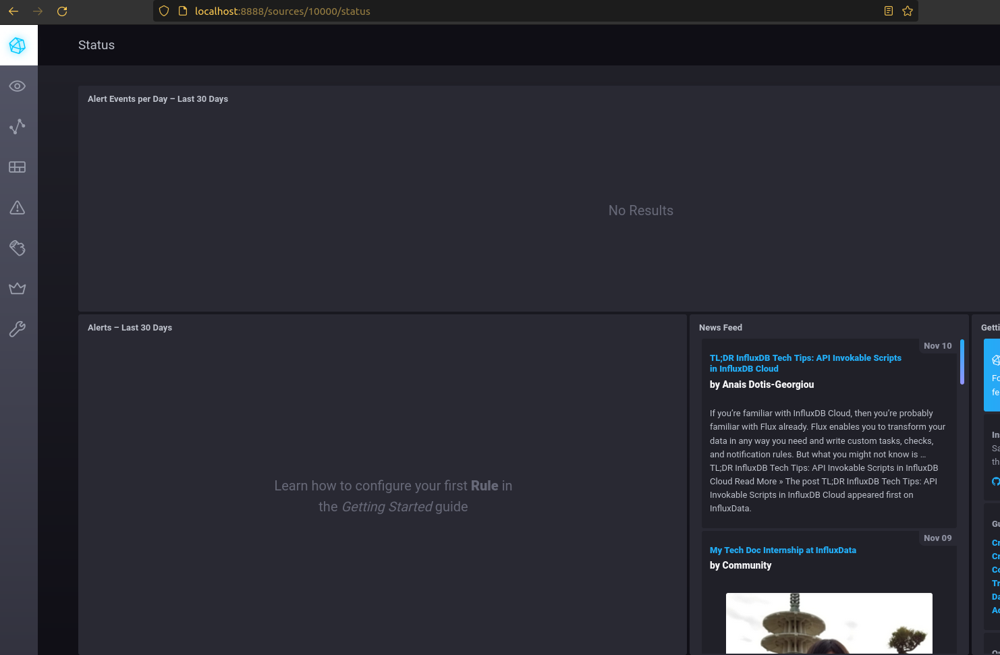
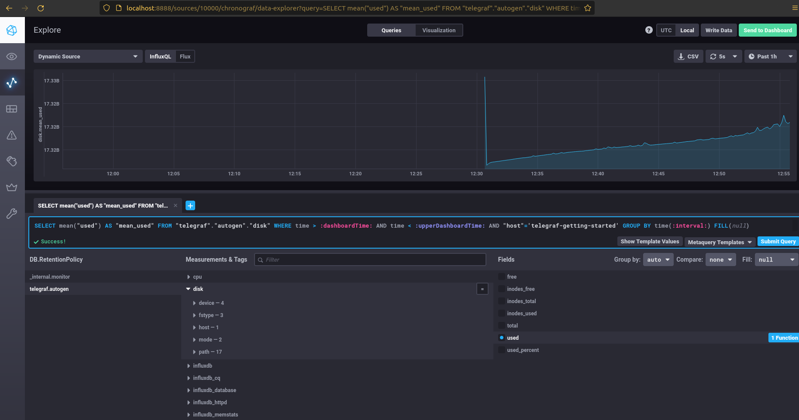
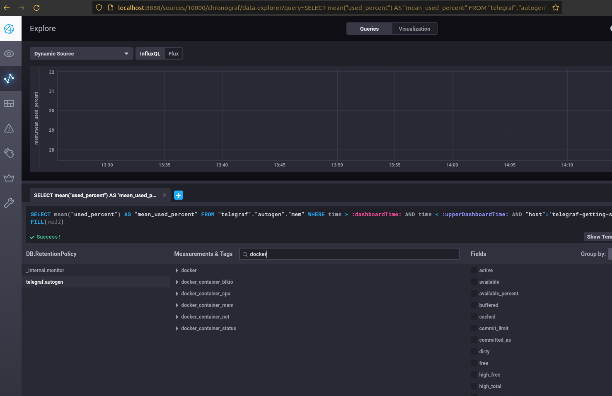
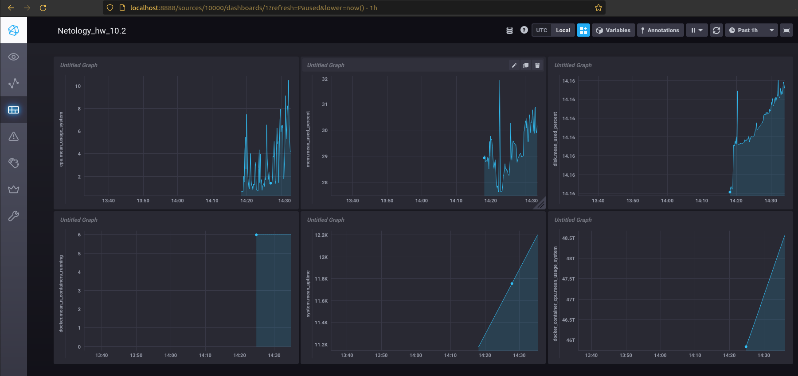

## Домашнее задание к занятию "10.02. Системы мониторинга"

## Обязательные задания

1. Опишите основные плюсы и минусы pull и push систем мониторинга.  

#### Ответ:
В презентацию не заглядывал, но по статьям, нашел почти то же, что и там:  
https://steve-mushero.medium.com/push-vs-pull-configs-for-monitoring-c541eaf9e927  
https://giedrius.blog/2019/05/11/push-vs-pull-in-monitoring-systems/  

Pull системы  
  + Легче контролировать достоверность и объем передаваемых данных  
	т.к. соединение инициирует сам сервер.  
  + проще зашифровать трафик например TLS прокси сервер  
  + проще получать данные по запросу.  
  + возможность получить точно синхронизированные данные с нескольких хостов.  

Push системы.  
+ легче репликация на несколько удаленных серверов сбора.  
	агент может отправить те же данные на несколько серверов.  
+ методы push, обычно быстрее pull, т.к. используют UDP и меньше нагружают хост-систему.  
+ централизованно определено какие метрики с хостов получаем.  
- изменение в структуре push системы , ведет за собой изменение в настройке каждого узла мониторинга.  
---

2. Какие из ниже перечисленных систем относятся к push модели, а какие к pull? А может есть гибридные?  

    - Prometheus 	- pull, но есть вариант с PushGateway(это все-таки не push)
    - TICK	      - push, (telegraph сам передает данные)есть возможность настроить как pull
    - Zabbix		  - push, есть вариант с Активными проверками - тогда будет pull.
    - VictoriaMetrics	- pull, БД временных рядов(как и Prometheus), с возможностью опроса источников данных.
    - Nagios		  - pull.
---

3. Склонируйте себе [репозиторий](https://github.com/influxdata/sandbox/tree/master) и запустите TICK-стэк, 
используя технологии docker и docker-compose.

В виде решения на это упражнение приведите выводы команд с вашего компьютера (виртуальной машины):

    - curl http://localhost:8086/ping
    - curl http://localhost:8888
    - curl http://localhost:9092/kapacitor/v1/ping

А также скриншот веб-интерфейса ПО chronograf (`http://localhost:8888`). 

P.S.: если при запуске некоторые контейнеры будут падать с ошибкой - проставьте им режим `Z`, например
`./data:/var/lib:Z`  
#### Ответ:  

```
andrey@WS01:~/102/sandbox$ curl http://localhost:8888 -v
*   Trying 127.0.0.1:8888...
* TCP_NODELAY set
* Connected to localhost (127.0.0.1) port 8888 (#0)
> GET / HTTP/1.1
> Host: localhost:8888
> User-Agent: curl/7.68.0
> Accept: */*
> 
* Mark bundle as not supporting multiuse
< HTTP/1.1 200 OK
< Accept-Ranges: bytes
< Cache-Control: public, max-age=3600
< Content-Length: 336
< Content-Security-Policy: script-src 'self'; object-src 'self'
< Content-Type: text/html; charset=utf-8
< Etag: "336820331"
< Last-Modified: Fri, 08 Oct 2021 20:33:01 GMT
< Vary: Accept-Encoding
< X-Chronograf-Version: 1.9.1
< X-Content-Type-Options: nosniff
< X-Frame-Options: SAMEORIGIN
< X-Xss-Protection: 1; mode=block
< Date: Thu, 11 Nov 2021 09:41:06 GMT
< 
* Connection #0 to host localhost left intact
andrey@WS01:~/102/sandbox$ curl http://localhost:8888
<!DOCTYPE html><html><head><meta http-equiv="Content-type" content="text/html; charset=utf-8"><title>Chronograf</title><link rel="icon shortcut" href="/favicon.fa749080.ico"><link rel="stylesheet" href="/src.3dbae016.css"></head><body> <div id="react-root" data-basepath=""></div> <script src="/src.fab22342.js"></script> </body></html>
andrey@WS01:~/102/sandbox$ curl http://localhost:9092/kapacitor/v1/ping -v
*   Trying 127.0.0.1:9092...
* TCP_NODELAY set
* Connected to localhost (127.0.0.1) port 9092 (#0)
> GET /kapacitor/v1/ping HTTP/1.1
> Host: localhost:9092
> User-Agent: curl/7.68.0
> Accept: */*
> 
* Mark bundle as not supporting multiuse
< HTTP/1.1 204 No Content
< Content-Type: application/json; charset=utf-8
< Request-Id: 8a3067d4-42d3-11ec-80b9-000000000000
< X-Kapacitor-Version: 1.6.2
< Date: Thu, 11 Nov 2021 09:41:26 GMT
< 
* Connection #0 to host localhost left intact
andrey@WS01:~/102/sandbox$ 
```
Скриншот Chronograf:  

---

4. Перейдите в веб-интерфейс Chronograf (`http://localhost:8888`) и откройте вкладку `Data explorer`.

    - Нажмите на кнопку `Add a query`
    - Изучите вывод интерфейса и выберите БД `telegraf.autogen`
    - В `measurments` выберите mem->host->telegraf_container_id , а в `fields` выберите used_percent. 
    Внизу появится график утилизации оперативной памяти в контейнере telegraf.
    - Вверху вы можете увидеть запрос, аналогичный SQL-синтаксису. 
    Поэкспериментируйте с запросом, попробуйте изменить группировку и интервал наблюдений.

Для выполнения задания приведите скриншот с отображением метрик утилизации места на диске 
(disk->host->telegraf_container_id) из веб-интерфейса.  
#### Ответ:  
У меня не оказалось метрик диска и памяти, добавлял по документации telegraf -а:  
Добавляем сбор метрик по памяти и диску в telegraf/telegraf.conf:  
https://github.com/influxdata/telegraf/tree/master/plugins/inputs/mem  
```
# Read metrics about memory usage  
[[inputs.mem]]
  # no configuration
```
https://github.com/influxdata/telegraf/tree/master/plugins/inputs/disk
```
[[inputs.disk]]
  ## By default stats will be gathered for all mount points.
  ## Set mount_points will restrict the stats to only the specified mount points.
  # mount_points = ["/"]
```
Контейнер Telegraf не стартовал, добавил опцию "Z" к 
```
- ./telegraf/:/etc/telegraf/:Z"
```
в docker-compose.yml, запустился.   
Метрики появились.  
Скриншот:  


---

5. Изучите список [telegraf inputs](https://github.com/influxdata/telegraf/tree/master/plugins/inputs). 
Добавьте в конфигурацию telegraf следующий плагин - [docker](https://github.com/influxdata/telegraf/tree/master/plugins/inputs/docker):
```
[[inputs.docker]]
  endpoint = "unix:///var/run/docker.sock"
```

Дополнительно вам может потребоваться донастройка контейнера telegraf в `docker-compose.yml` дополнительного volume и 
режима privileged:
```
  telegraf:
    image: telegraf:1.4.0
    privileged: true
    volumes:
      - ./etc/telegraf.conf:/etc/telegraf/telegraf.conf:Z
      - /var/run/docker.sock:/var/run/docker.sock:Z
    links:
      - influxdb
    ports:
      - "8092:8092/udp"
      - "8094:8094"
      - "8125:8125/udp"
```

После настройке перезапустите telegraf, обновите веб интерфейс и приведите скриншотом список `measurments` в 
веб-интерфейсе базы telegraf.autogen . Там должны появиться метрики, связанные с docker.

Факультативно можете изучить какие метрики собирает telegraf после выполнения данного задания.
#### Ответ:  
Плагин докера уже был в конфиге.  
Дополнительные донастройки сделал, но метрики не появились, вывод docker logs контейнера писал ошибки по правам доступа на docker.sock  
Добавил прав(без разбора 777: sudo chmod 777 /var/run/docker.sock) - метрики по docker появились.  
Скриншот:  


## Дополнительное задание (со звездочкой*) - необязательно к выполнению

В веб-интерфейсе откройте вкладку `Dashboards`. Попробуйте создать свой dashboard с отображением:

    - утилизации ЦПУ
    - количества использованного RAM
    - утилизации пространства на дисках
    - количество поднятых контейнеров
    - аптайм
    - ...
    - фантазируйте)
 Скриншот:  
 
 ---
