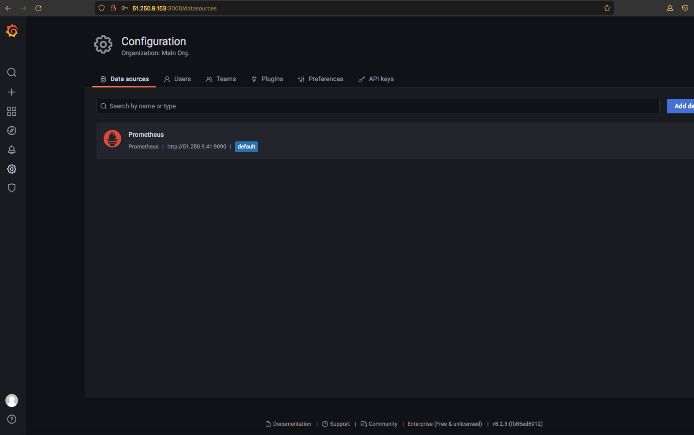
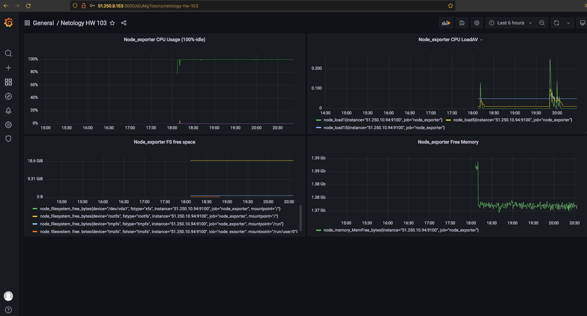
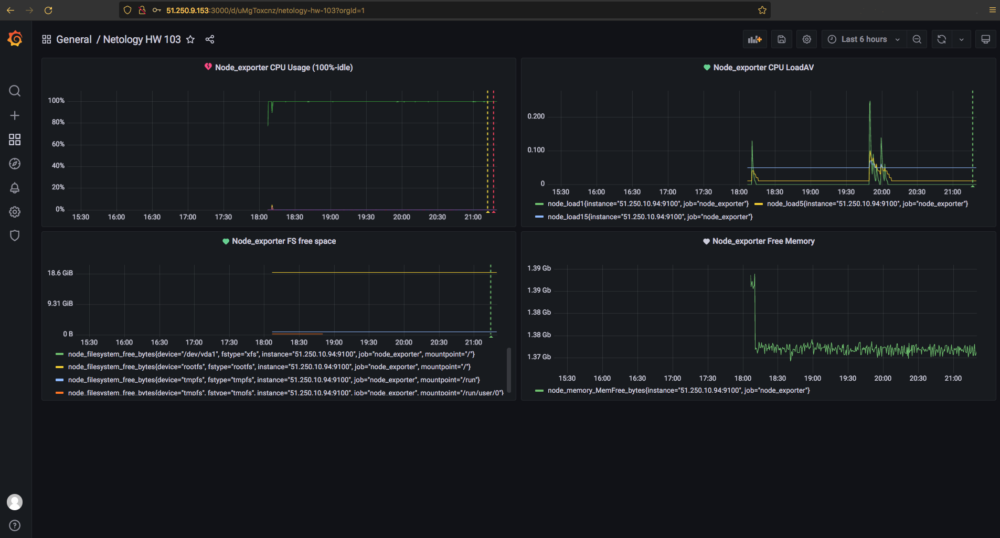

### Домашнее задание к занятию "10.03. Grafana"

#### Задание повышенной сложности

**В части задания 1** не используйте директорию [help](./help) для сборки проекта, самостоятельно разверните grafana, где в 
роли источника данных будет выступать prometheus, а сборщиком данных node-exporter:
- grafana
- prometheus-server
- prometheus node-exporter

За дополнительными материалами, вы можете обратиться в официальную документацию grafana и prometheus.

В решении к домашнему заданию приведите также все конфигурации/скрипты/манифесты, которые вы 
использовали в процессе решения задания.

##### Ответ:  
Скачиваем последнюю версию node exporter:
```
[andrey@fhm7n4g0leglqhs4h4ds ~]$ wget https://github.com/prometheus/node_exporter/releases/download/v1.2.2/node_exporter-1.2.2.linux-amd64.tar.gz
```
Распаковываем:
```
[andrey@fhm7n4g0leglqhs4h4ds ~]$ tar -xvzf node_exporter-1.2.2.linux-amd64.tar.gz
```
Копируем в /usr/local/bin/
```
[andrey@fhm7n4g0leglqhs4h4ds ~]$ sudo cp ./node_exporter-1.2.2.linux-amd64/node_exporter /usr/local/bin/
```
Создаем сервис для запуска экпортера:
```
[andrey@fhm7n4g0leglqhs4h4ds ~]$ vi /etc/systemd/system/node_exporter.service:
```
Пишем:
```
[Unit]
Description=Node Exporter
Wants=network-online.target
After=network-online.target

[Service]
User=node_exporter
Group=node_exporter
ExecStart=/usr/local/bin/node_exporter

[Install]
WantedBy=default.target
```
Создаем пользователя для запуска сервиса:
```
[andrey@fhm7n4g0leglqhs4h4ds ~]$ sudo useradd --no-create-home --shell /bin/false node_exporter
```
Перечитываем конфиги сервисов:
```
[andrey@fhm7n4g0leglqhs4h4ds ~]$ sudo systemctl daemon-reload
```
Запускаем node_exporter:
```
[andrey@fhm7n4g0leglqhs4h4ds ~]$ sudo systemctl start node_exporter
```
Проверяем статус:
```
[andrey@fhm7n4g0leglqhs4h4ds ~]$ sudo systemctl status node_exporter
```
Включаем автозупуск:
```
[andrey@fhm7n4g0leglqhs4h4ds ~]$ sudo systemctl enable node_exporter
```
Проверяем метрики:
```
[andrey@fhm7n4g0leglqhs4h4ds ~]$ curl http://localhost:9100/metrics
```
Устанавливаем Prometheus:  

Скачиваем:  
```
[andrey@fhm7bnfdi071dd1f5s9h ~]$ wget https://github.com/prometheus/prometheus/releases/download/v2.31.1/prometheus-2.31.1.linux-amd64.tar.gz
```
Распакуем:
```
[andrey@fhm7bnfdi071dd1f5s9h ~]$ tar -xvzf prometheus-2.31.1.linux-amd64.tar.gz
```
Распихаем файлы и каталоги по нужным директориям:
```
[andrey@fhm7bnfdi071dd1f5s9h ~]$ sudo cp prometheus-2.31.1.linux-amd64/prometheus /usr/local/bin/
[andrey@fhm7bnfdi071dd1f5s9h ~]$ sudo cp prometheus-2.31.1.linux-amd64/promtool /usr/local/bin/
[andrey@fhm7bnfdi071dd1f5s9h ~]$ sudo mkdir /etc/prometheus
[andrey@fhm7bnfdi071dd1f5s9h ~]$ sudo cp -r prometheus-2.31.1.linux-amd64/consoles/ /etc/prometheus/consoles
[andrey@fhm7bnfdi071dd1f5s9h ~]$ sudo cp -r prometheus-2.31.1.linux-amd64/console_libraries/ /etc/prometheus/console_libraries
[andrey@fhm7bnfdi071dd1f5s9h ~]$ sudo cp prometheus-2.31.1.linux-amd64/prometheus.yml /etc/prometheus/
```
Создадим пользователя для Prometheus -а:
```
[andrey@fhm7bnfdi071dd1f5s9h ~]$ sudo useradd --no-create-home --shell /bin/false prometheus
```
Дадим ему права на каталог с конфигами Promethius:  
```
[andrey@fhm7bnfdi071dd1f5s9h ~]$ sudo chown -R prometheus:prometheus /etc/prometheus
```
Создадим каталог для бд:
```
[andrey@fhm7bnfdi071dd1f5s9h ~]$ sudo mkdir /var/lib/prometheus
```
Дадим права:
```
[andrey@fhm7bnfdi071dd1f5s9h ~]$ sudo chown prometheus:prometheus /var/lib/prometheus
```
В /etc/prometheus/prometheus.yml добавляю:
```
  - job_name: 'node_exporter'
    static_configs:
      - targets: ['51.250.10.94:9100']
```
51.250.10.94 - адрес узла, на котором установлен node exporter.

Создаём юнит для запуска сервиса(/etc/systemd/system/prometheus.service):
```
[andrey@fhm7bnfdi071dd1f5s9h ~]$ sudo vi /etc/systemd/system/prometheus.service
```
Туда пишем:
```
[Unit]
Description=Prometheus
Wants=network-online.target
After=network-online.target

[Service]
User=prometheus
Group=prometheus
ExecStart=/usr/local/bin/prometheus \
    --config.file /etc/prometheus/prometheus.yml \
    --storage.tsdb.path /var/lib/prometheus/ \
    --web.console.templates=/etc/prometheus/consoles \
    --web.console.libraries=/etc/prometheus/console_libraries

[Install]
WantedBy=default.target
```
Перечитываем конфиги сервисов:
```
[andrey@fhm7bnfdi071dd1f5s9h ~]$ sudo systemctl daemon-reload
```
Стартуем:
```
[andrey@fhm7bnfdi071dd1f5s9h ~]$ sudo systemctl start prometheus
```
Проверяем:
```
[andrey@fhm7bnfdi071dd1f5s9h ~]$ sudo systemctl status prometheus
```
Включаем на постоянно:
```
[andrey@fhm7bnfdi071dd1f5s9h ~]$ sudo systemctl enable prometheus
```
Проверим:
```
[andrey@fhm7bnfdi071dd1f5s9h ~]$ curl localhost:9090/metrics
```

Скачиваем Grafana:
```
[andrey@fhm3tis2ou4hu88cbdpv ~]$ wget https://dl.grafana.com/enterprise/release/grafana-enterprise-8.2.3-1.x86_64.rpm
```
устанавливаем:
```
[andrey@fhm3tis2ou4hu88cbdpv ~]$ sudo yum install grafana-enterprise-8.2.3-1.x86_64.rpm
```
Запускаем, проверяем и включаем:
```
[andrey@fhm3tis2ou4hu88cbdpv ~]$ sudo systemctl start grafana-server
[andrey@fhm3tis2ou4hu88cbdpv ~]$ sudo systemctl status grafana-server
[andrey@fhm3tis2ou4hu88cbdpv ~]$ sudo systemctl enable grafana-server
```
Скриншот:  

**В части задания 3** вы должны самостоятельно завести удобный для вас канал нотификации, например Telegram или Email
и отправить туда тестовые события.

В решении приведите скриншоты тестовых событий из каналов нотификаций.

#### Обязательные задания

#### Задание 1
Используя директорию [help](./help) внутри данного домашнего задания - запустите связку prometheus-grafana.

Зайдите в веб-интерфейс графана, используя авторизационные данные, указанные в манифесте docker-compose.

Подключите поднятый вами prometheus как источник данных.

Решение домашнего задания - скриншот веб-интерфейса grafana со списком подключенных Datasource.

---

#### Задание 2
Изучите самостоятельно ресурсы:
- [promql-for-humans](https://timber.io/blog/promql-for-humans/#cpu-usage-by-instance)
- [understanding prometheus cpu metrics](https://www.robustperception.io/understanding-machine-cpu-usage)

Создайте Dashboard и в ней создайте следующие Panels:
- Утилизация CPU для nodeexporter (в процентах, 100-idle)
- CPULA 1/5/15
- Количество свободной оперативной памяти
- Количество места на файловой системе

Для решения данного ДЗ приведите promql запросы для выдачи этих метрик, а также скриншот получившейся Dashboard.

##### Ответ:
CPU Usage:  
rate(node_cpu_seconds_total{instance="51.250.10.94:9100"}[1m])*100  
FS free space:  
node_filesystem_free_bytes{instance="51.250.10.94:9100"}  
CPU LA  
node_load1{instance="51.250.10.94:9100"}  
node_load5{instance="51.250.10.94:9100"}  
node_load15{instance="51.250.10.94:9100"}  
RAM Free:  
node_memory_MemFree_bytes{instance="51.250.10.94:9100"}  
Скриншот:  
  

---

#### Задание 3
Создайте для каждой Dashboard подходящее правило alert (можно обратиться к первой лекции в блоке "Мониторинг").

Для решения ДЗ - приведите скриншот вашей итоговой Dashboard.

##### Ответ:



---

#### Задание 4
Сохраните ваш Dashboard.

Для этого перейдите в настройки Dashboard, выберите в боковом меню "JSON MODEL".

Далее скопируйте отображаемое json-содержимое в отдельный файл и сохраните его.

В решении задания - приведите листинг этого файла.  

Ссылка:  
  

---
