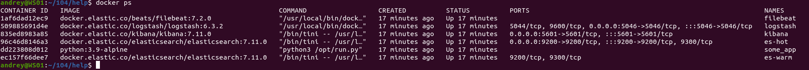
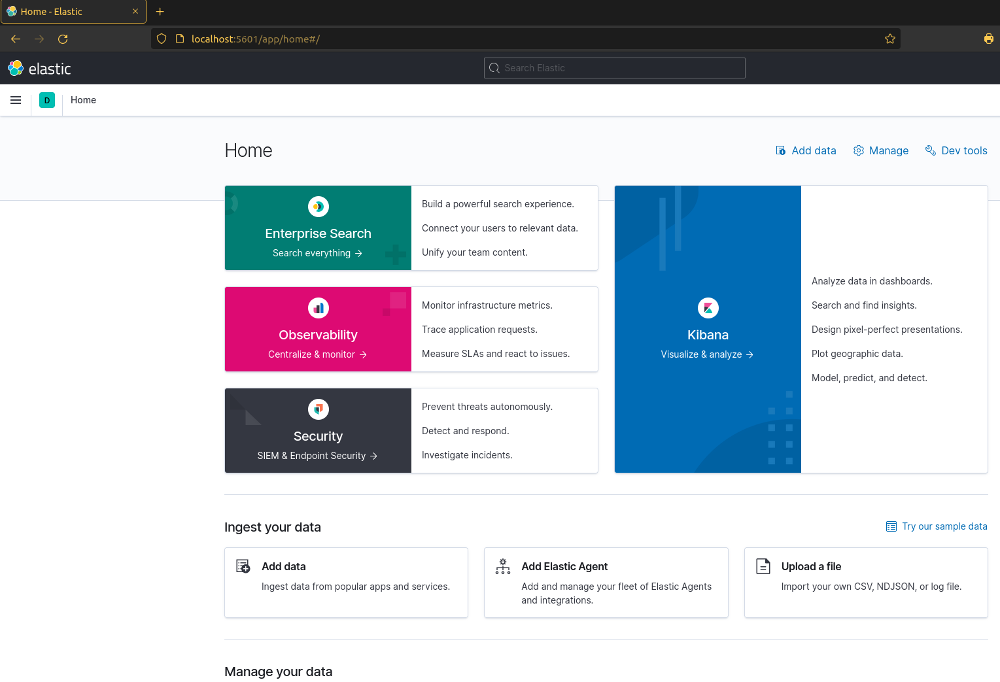
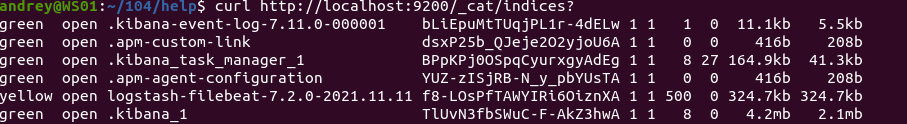
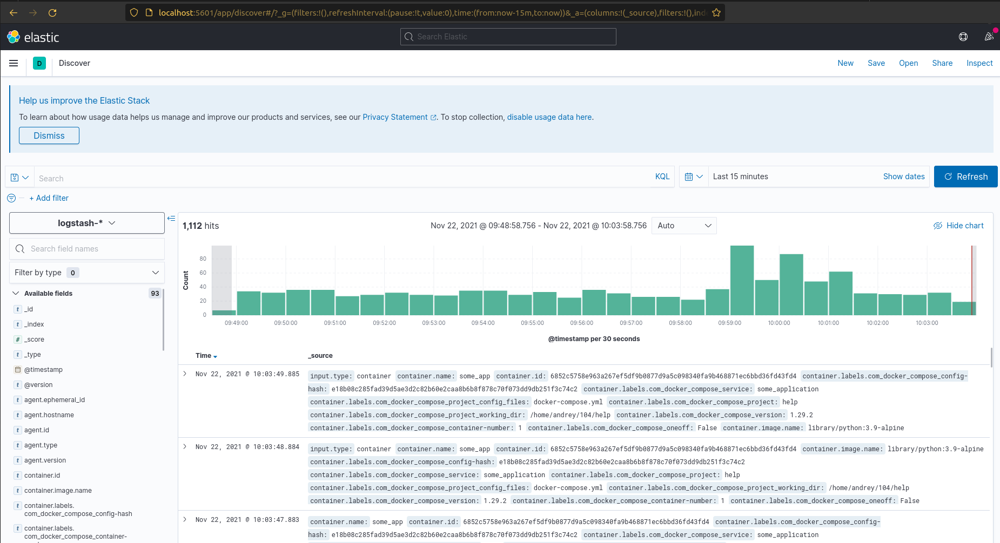
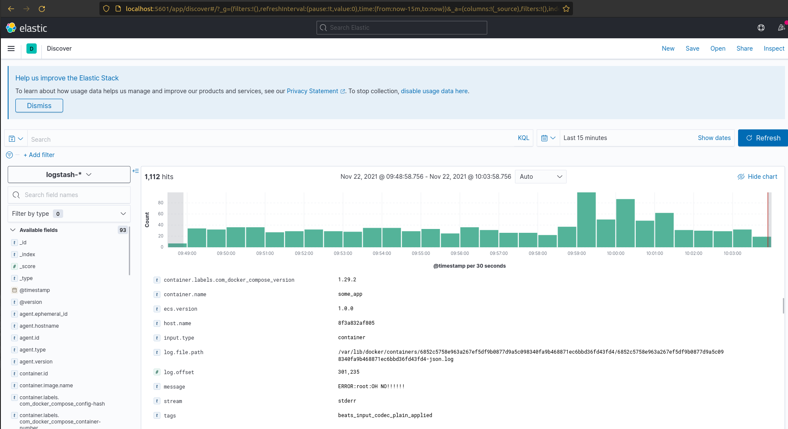
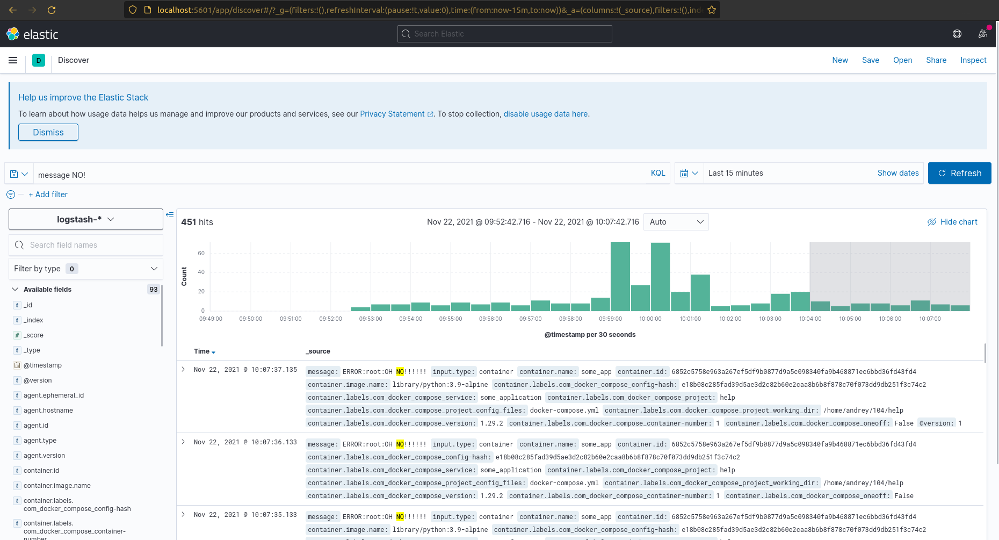
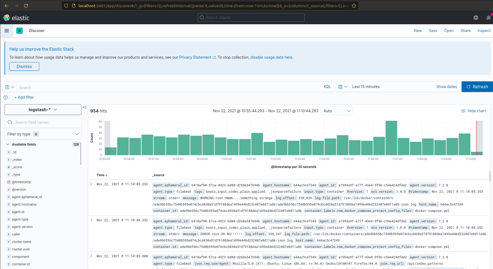

# Домашнее задание к занятию "10.04. ELK"

## Дополнительные ссылки

При выполнении задания пользуйтесь вспомогательными ресурсами:

- [поднимаем elk в докер](https://www.elastic.co/guide/en/elastic-stack-get-started/current/get-started-docker.html)
- [поднимаем elk в докер с filebeat и докер логами](https://www.sarulabs.com/post/5/2019-08-12/sending-docker-logs-to-elasticsearch-and-kibana-with-filebeat.html)
- [конфигурируем logstash](https://www.elastic.co/guide/en/logstash/current/configuration.html)
- [плагины filter для logstash](https://www.elastic.co/guide/en/logstash/current/filter-plugins.html)
- [конфигурируем filebeat](https://www.elastic.co/guide/en/beats/libbeat/5.3/config-file-format.html)
- [привязываем индексы из elastic в kibana](https://www.elastic.co/guide/en/kibana/current/index-patterns.html)
- [как просматривать логи в kibana](https://www.elastic.co/guide/en/kibana/current/discover.html)
- [решение ошибки increase vm.max_map_count elasticsearch](https://stackoverflow.com/questions/42889241/how-to-increase-vm-max-map-count)

В процессе выполнения задания могут возникнуть также не указанные тут проблемы в зависимости от системы.

Используйте output stdout filebeat/kibana и api elasticsearch для изучения корня проблемы и ее устранения.

### Задание повышенной сложности

Не используйте директорию [help](./help) при выполнении домашнего задания.

## Задание 1

Вам необходимо поднять в докере:
- elasticsearch(hot и warm ноды)
- logstash
- kibana
- filebeat

и связать их между собой.

Logstash следует сконфигурировать для приёма по tcp json сообщений.

Filebeat следует сконфигурировать для отправки логов docker вашей системы в logstash.

В директории [help](./help) находится манифест docker-compose и конфигурации filebeat/logstash для быстрого 
выполнения данного задания.

Результатом выполнения данного задания должны быть:
- скриншот `docker ps` через 5 минут после старта всех контейнеров (их должно быть 5)
- скриншот интерфейса kibana
- docker-compose манифест (если вы не использовали директорию help)
- ваши yml конфигурации для стека (если вы не использовали директорию help)

### Ответ:

Сделал:
```
sudo sysctl -w vm.max_map_count=262144
```


Посмотрел, за что отвечает этот параметр:  
https://sysctl-explorer.net/vm/max_map_count/  
This file contains the maximum number of memory map areas a process may have. Memory map areas are used as a side-effect of calling malloc, directly by mmap, mprotect, and madvise, and also when loading shared libraries.
While most applications need less than a thousand maps, certain programs, particularly malloc debuggers, may consume lots of them, e.g., up to one or two maps per allocation.
The default value is 65536.  
Устанавливает кол-во памяти видимое для процесса.  

Так же сделал(filebeat ругался при старте):
```
chown -R root ./configs
chmod -R 644 ./configs
```
Потом все запустилось нормально  
Скриншоты:





---

## Задание 2

Перейдите в меню [создания index-patterns  в kibana](http://localhost:5601/app/management/kibana/indexPatterns/create)
и создайте несколько index-patterns из имеющихся.

Перейдите в меню просмотра логов в kibana (Discover) и самостоятельно изучите как отображаются логи и как производить 
поиск по логам.

В манифесте директории help также приведенно dummy приложение, которое генерирует рандомные события в stdout контейнера.
Данные логи должны порождать индекс logstash-* в elasticsearch. Если данного индекса нет - воспользуйтесь советами 
и источниками из раздела "Дополнительные ссылки" данного ДЗ.

#### Ответ:  
При запуске, все логи logstash отправлял не в Elasticsearch, а в stdout, видно было по выводу(и индексы не создавались в ES).  
Поэксперементировал, поправил конфиги:  
Для filebeat-а(filebeat.yml) сменил порт на который он отправляет логи в logstash с 5046 на 5044, т.к. на этом порту logstash стандартно слушает beats -ы.  
Для logstash pipeline (logstash.conf) поменял:  
Для input поставил:   beats { port => 5044 }  
Т.к. logstash читал pipeline(logstash.conf) по пути:  
```
path.config: "/usr/share/logstash/pipeline"  
```
(прописан в ./config/pipelines.yml ), то в docker-compose.yml   
поменял путь, куда монтируется logstash.conf на нужный.   
По умолчанию там был файл с таким содержанием:
```
bash-4.2$ cat /usr/share/logstash/pipeline/logstash.conf
input {
  beats {
    port => 5044
  }
}

output {
  stdout {
    codec => rubydebug
  }
}
```
т.е. вывод в stdout.  
Отредактированные файлы прилагаю.  
[docker-compose.yml](docker-compose.yml)  
[filebeat.yml](filebeat.yml)  
[logstash.conf](logstash.conf)  

Скриншоты:









