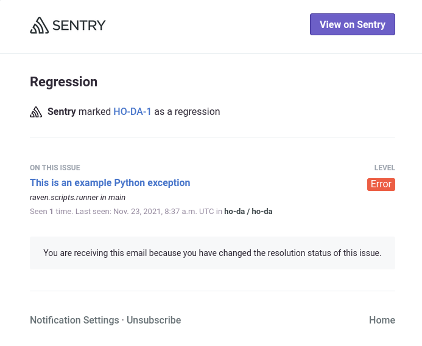

# Домашнее задание к занятию "10.05. Sentry"

## Задание 1

Так как self-hosted Sentry довольно требовательная к ресурсам система, мы будем использовать Free cloud аккаунт.

Free cloud account имеет следующие ограничения:
- 5 000 errors
- 10 000 transactions
- 1 GB attachments

Для подключения Free cloud account:
- зайдите на sentry.io
- нажжмите "Try for free"
- используйте авторизацию через ваш github-account
- далее следуйте инструкциям

Для выполнения задания - пришлите скриншот меню Projects.  
Сначала сделал скриншот, позже увидел, что не то заснял, выложил новый, но уже после добавления второго проекта.  


## Задание 2

Создайте python проект и нажмите `Generate sample event` для генерации тестового события.

Изучите информацию, представленную в событии.

Перейдите в список событий проекта, выберите созданное вами и нажмите `Resolved`.

Для выполнения задание предоставьте скриншот `Stack trace` из этого события и список событий проекта, 
после нажатия `Resolved`.


## Задание 3

Перейдите в создание правил алёртинга.

Выберите проект и создайте дефолтное правило алёртинга, без настройки полей.

Снова сгенерируйте событие `Generate sample event`.

Если всё было выполнено правильно - через некоторое время, вам на почту, привязанную к github аккаунту придёт
оповещение о произошедшем событии.

Если сообщение не пришло - проверьте настройки аккаунта Sentry (например привязанную почту), что у вас не было 
`sample issue` до того как вы его сгенерировали и то, что правило алёртинга выставлено по дефолту (во всех полях all).
Также проверьте проект в котором вы создаёте событие, возможно алёрт привязан к другому.

Для выполнения задания - пришлите скриншот тела сообщения из оповещения на почте.


Дополнительно поэкспериментируйте с правилами алёртинга. 
Выбирайте разные условия отправки и создавайте sample events. 

## Задание повышенной сложности

Создайте проект на ЯП python или GO (небольшой, буквально 10-20 строк), подключите к нему sentry SDK и отправьте несколько тестовых событий.
Поэкспериментируйте с различными передаваемыми параметрами, но помните об ограничениях free учетной записи cloud Sentry.

Для выполнения задания пришлите скриншот меню issues вашего проекта и 
пример кода подключения sentry sdk/отсылки событий.

Взял код из дз первого модуля(https://github.com/andrey-tyumin/hw4.2), подключил код sentry:
```
#!/usr/bin/env python3

import os
import socket
import sentry_sdk
sentry_sdk.init(
    "https://many_digits_and_letters@digits.ingest.sentry.io/6076892",

    # Set traces_sample_rate to 1.0 to capture 100%
    # of transactions for performance monitoring.
    # We recommend adjusting this value in production.
    traces_sample_rate=1.0
)

log_file = './log.txt'
remotes = ('drive.google.com', 'mail.google.com', 'google.com')

if not os.path.isfile(log_file):
    open(log_file, 'a')
    file = open(log_file, "w")
    for i in range(0, 3):
        file.write(socket.gethostbyname(remotes[i])+'\n')
    file.close()
    print('No old data, first run, logging to file')
else:
    with open(log_file) as f:
        old_data = f.readlines()
        old_data = [line.rstrip() for line in old_data]
    file = open(log_file, "w")
    for i in range(0, 3):
        new_data_str = socket.gethostbyname(remotes[i])
        file.write(new_data_str + '\n')
        if old_data[i] != new_data_str:
            print('[ERROR] '+remotes[i]+' IP mismatch: Old IP= '+old_data[i]+', New IP= '+new_data_str)
        else:
            print(remotes[i]+' '+new_data_str+' Ok')
    file.close()
    #division_by_zero = 1 / 0
    #raise Exception("For netology_hw_105")
    #c=a*8
```
В конце загенерил три ошибки, включал по одной и получал алерты и сообщения на почту:

  
  
  

